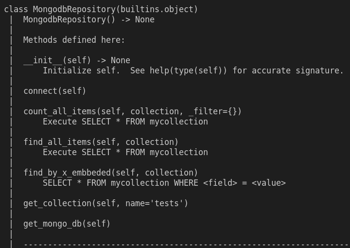

# Aprendizado mongodb com o uso do driver Pymongo(python)

O presente projeto é configurado usando docker e docker-compose.

## Estrutura da Classe e métodos presentes

## Interação com a classe

1 - Construção da imagem e criação e execução do container

    docker-compose up --build

    docker exec -it mongo_app_1 bash
